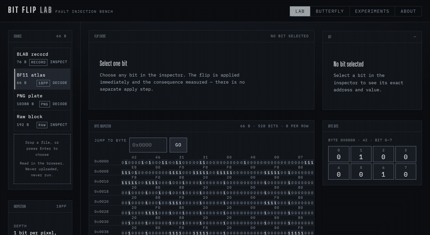

# Bit Flip Lab

## One Bit. One Mutation. Watch What Changes.

<p align="center">
  
</p>

Bit Flip Lab is a deterministic bit-level fault-injection and measurement
instrument. Select one bit, and it flips that bit, re-decodes the result, and
reports exactly what changed — across raw bytes, decoded structure, integrity
checks, and rendered output.

*Every frame above was captured from the running application. `F8 → D8`,
`1 of 448`, `x10 y0 1×1` and `Minor` were computed by the engine from the bytes.*

`Deterministic` · `Bit-level` · `Fault injection` · `Measurement` · `Format-aware` · `Browser-based`

<table align="center">
<tr><td align="center"><b>ONE BIT</b></td><td align="center">→</td><td align="center"><b>ONE BYTE</b></td><td align="center">→</td><td align="center"><b>ONE MUTATION</b></td><td align="center">→</td><td align="center"><b>MEASURE</b></td><td align="center">→</td><td align="center"><b>OBSERVE</b></td></tr>
</table>

---

## The Instrument


Select a bit and the mutation happens immediately — no separate apply step, so the
numbers on screen are always the result of a real, completed mutation. The causal
rail lights only for stages that actually measured something. The byte inspector
is virtualised and keyboard-navigable: one tab stop, arrow keys to move.

## 01 — One Bit → One Pixel


The 1-bit glyph atlas stores one bit per pixel, so there is no gap between the byte
and the image. Bit 90, byte `0x000B`:

```text
BIT 90   byte 0x000B  F8 → D8   xor 0x20
Pixels changed:      1 of 448
Changed region:      x10 y0, 1×1
Mean absolute error: 0.366
Severity:            Minor — structure validated, 1 decoded field changed
```

The byte delta is one. The pixel delta is one. Both are stated exactly rather than
implied as something larger.

## 02 — One Bit → Invalid PNG


Move the same operation a few bits left, into a PNG's 8-byte file signature.
Bit 20, byte `0x0002`:

```text
BIT 20   byte 0x0002  4E → 46   xor 0x08
Reported:   PNG signature does not match 89 50 4E 47 0D 0A 1A 0A
Severity:   Critical — the decoded output failed on the mutated bytes
                        but succeeded on the original
```

The mutated buffer is no longer a valid PNG and the decoder rejects it. Nothing
was rendered from it, so there is no mutated image to diff — the original is shown
beside the failure. This does not generalise: most bits in this same PNG are not
Critical. That is what makes the measurement interesting.

## 03 — Butterfly Mode


Butterfly Mode stops hand-picking bits. It sweeps a bounded set of positions,
applies the identical mutation to each, and records the measured consequence. The
map is a direct plot of those measurements — no model, no interpolation.

```text
Source:     BLAB record, 76 bytes → 608 addressable bits
Sweep:      64 positions      Coverage: 10.5% of addressable bits
```

All four magic-byte positions read **Critical**; the remaining 60 read **Major**.
Every row names the reason:

```text
bit 48   0x0006  MAJOR  2 structural checks failed while the buffer still decodes.
                      Measured: Length field at 0x06 declares 2147483724 bytes;
                      file contains 76; CRC-32 at 0x48 is 0xCEC06CB0;
                      computed 0x8EB545C3
```

**Same file. Different bit. Different consequence** — located to a field offset,
with both values. Coverage is reported, never implied.

---

## Why This Is Interesting

A hex viewer tells you what bytes a file contains. Bit Flip Lab asks a different
question: *what happens if exactly one of them changes?*

Because the consequence of one bit is decided entirely by what that bit
controls, the same operation can be invisible, locally visible, or fatal. The
tool measures that consequence across raw bytes, decoded structure, integrity
checks, rendered output, and a severity derived by rule rather than asserted — and
prints the rule that fired next to the result.

## How It Works


```text
Input → Bit Selection → Mutation Engine → Format Adapter
      → Decoder / Inspector → Measurement → Severity
```

The core engine is pure and platform-free except for one file that needs the
browser's image decoder. SHA-256 is implemented in-repo rather than through
`crypto.subtle`, so the main thread, the worker, and Node under test cannot
diverge. Analysis runs in a worker and demotes itself to the main thread if one
cannot start.


Adding a format means implementing one `SourceAdapter` — `matches`, `inspect`,
`execute`, `measure` — and appending it to `ADAPTERS`. No pipeline, state or UI
change. A format is claimed by signature, never guessed.

---

## Built to Be Deterministic

| Verification | Result |
|---|---:|
| Unit tests | **150** |
| Playwright E2E | **32** |
| Release gate | **13 / 13** |
| Console errors | **0** |
| Axe violations | **0** |
| Contrast failures | **0** |

Strict TypeScript, production build, visual QA across three device profiles, and
an accessibility audit that walks the keyboard and checks reduced motion. Every
screenshot and the hero GIF are generated from the running application by `qa/`,
and the capture aborts if a console error occurred.

Full detail, including the defects this harness caught: **[docs/QA.md](docs/QA.md)**

## Quick Start

```bash
git clone https://github.com/MadB0i/Bit-Flip-Lab.git
cd Bit-Flip-Lab
npm install
npm run dev
```

Node 20 or newer. No backend, no network access at runtime, no accounts.

```bash
npm run verify      # lint, unit tests, build, browser tests
```

## Boundaries

Severity is derived by rule and the rule is always printed next to the result.
An unsupported format stays `Unclassified` rather than being given an invented
verdict — the 192-byte raw block is the deliberate example.

- **Not a hardware fault injector.** It demonstrates the representational
  principle, not silicon, timing, or multi-bit upsets.
- **No model is executed**, so no accuracy figure is reported. See
  [docs/SCIENTIFIC_NOTES.md](docs/SCIENTIFIC_NOTES.md).
- **Partial coverage.** A default Butterfly sweep measures 64 of 608 positions
  (10.5%) and says so.

## Safety

- Uploaded binaries are **never executed**. Bytes are read with
  `File.arrayBuffer()` and handled as data.
- Mutation happens on a **copy**; the source buffer is never written.
- Nothing is uploaded. All processing is in the tab.
- Mutated files are not written out, by design.

This is browser-level isolation, not an operating-system sandbox.

## Documentation

| Document | Contents |
|---|---|
| **[docs/ARCHITECTURE.md](docs/ARCHITECTURE.md)** | Pipeline, layer responsibilities, adapter contract, worker model, determinism |
| **[docs/EXPERIMENTS.md](docs/EXPERIMENTS.md)** | Full methodology, exact observations, severity rules, reproduction steps |
| **[docs/SCIENTIFIC_NOTES.md](docs/SCIENTIFIC_NOTES.md)** | What the results do and do not demonstrate; decoder dependence; interpretation limits |
| **[docs/QA.md](docs/QA.md)** | Test suites, accessibility QA, release gate, asset regeneration |

## License

MIT — see [LICENSE](LICENSE).