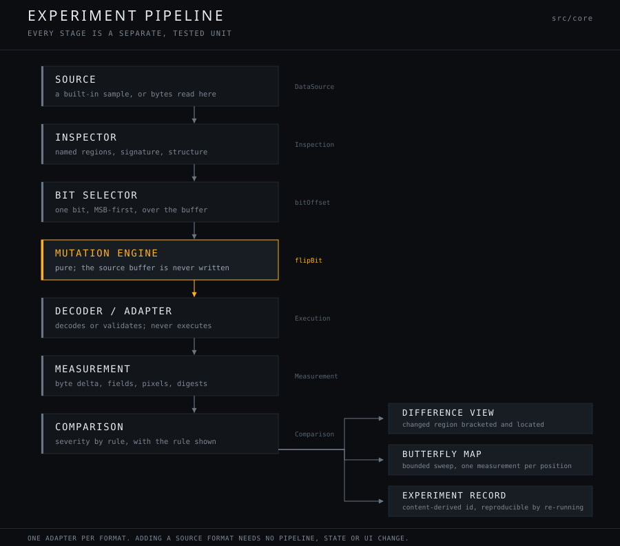
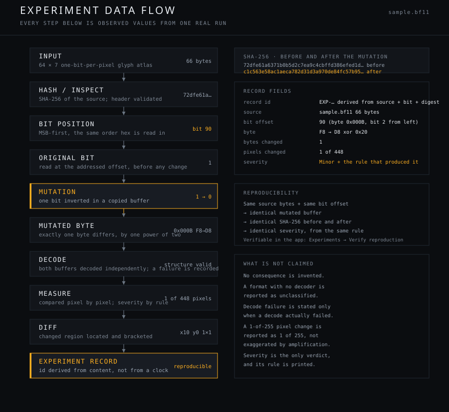

# Architecture

How Bit Flip Lab is built, and why it is shaped this way.



## Repository structure

```text
src/core/       Pure, deterministic. One browser-dependent file.
  bits.ts         MSB-first bit addressing
  mutate.ts       flipBit / flipBits — pure; the input is never written
  sha256.ts       FIPS 180-4, self-contained and synchronous
  crc32.ts        IEEE 802.3
  png.ts          PNG encoder (stored DEFLATE) + chunk and CRC parser
  labRecord.ts    BLAB structured record with a real CRC-32
  bitmap.ts       BF11 1-bit atlas and its 5×7 glyph font
  pixels.ts       RGBA difference and change-region marking — pure
  imageCodec.ts   the only file that touches a browser API
  adapters.ts     one SourceAdapter per format
  classify.ts     measurement → severity, with the rule stated
  experiment.ts   the pipeline, record creation, reproduction
  butterfly.ts    bounded systematic sweep
  pipeline.ts     the types every stage agrees on
  samples.ts      the four built-in sources
src/engine/     Web Worker with an automatic main-thread fallback
src/worker/     Worker entry point and message protocol
src/state/      Reducer, provider, and every asynchronous action
src/ui/         Panels. No component mutates data itself.
src/styles/     tokens.css (the design system), base.css, app.css
tests/unit/     Engine tests, 8 files
tests/e2e/      Playwright, the rendered interface
qa/             Capture, accessibility, invariant and release-gate scripts
docs/           Diagrams, curated captures, and this documentation
```

## Stage responsibilities

| Layer | Responsibility | Constraint |
|---|---|---|
| `core/bits` | Address one bit, MSB-first | No allocation beyond the result |
| `core/mutate` | Produce a new buffer with bits flipped | Never writes the input |
| `core/adapters` | Claim a format, inspect it, decode it, measure deltas | Claims by signature, never guesses |
| `core/pixels` | Diff two RGBA buffers, locate the changed region | Pure; no DOM |
| `core/classify` | Turn a measurement into a severity **and its rule** | Severity is derived, never asserted |
| `core/experiment` | Run the pipeline, build records, verify reproduction | Content-derived ids |
| `core/butterfly` | Choose an even set of bit positions to sweep | Bounded and reported |
| `engine/labEngine` | Run analysis off the main thread | Demotes to main thread on failure |
| `state/` | One reducer, one provider, all async actions | The only place effects are triggered |
| `ui/` | Render state, dispatch intent | No component mutates data |

## The analysis pipeline

```text
Input
  → Bit Selection
  → Mutation Engine
  → Format Adapter
  → Decoder / Inspector
  → Measurement
  → Severity
```



Each stage is a separate module with a typed contract, and each stage is
independently tested. The core engine is pure and platform-free except for
`imageCodec.ts`, which needs the browser's image decoder.

### Data flow of one experiment

```text
EXP-7D0F5ACC4A835DA7   BF11 atlas · 66 bytes
bit            90   (byte 0x000B, bit 2 of 7 from the left)
byte           F8 → D8   bit 1 → 0
integrity      SHA-256 before …  72dfef616371b0b5…
               SHA-256 after  …  c1c563e58ac1aea7…
bytes changed  1        bit count Δ 1
pixels changed 1 of 448   region x10 y0 1×1   MAE 0.366
severity       Minor — structure validated, 1 decoded field changed
```

The record id is derived from content — source, bit, resulting digest — not from a
clock, so the same experiment always yields the same id. **Experiments →
Verify reproduction** re-runs a recorded mutation and reports whether both
digests and the severity match.

## Adapter contract

Adding a format means implementing one `SourceAdapter` and appending it to
`ADAPTERS`. No pipeline, state, or UI change.

```text
matches(bytes)          does this adapter claim the buffer? be conservative
inspect(bytes)          named regions, signature, structure
execute(original, bytes) decode or validate; never execute content
measure(before, after)  byte delta, decoded-field delta, integrity checks
```

The four shipped adapters:

| Source | Bytes | Policy | Decoder |
|---|---:|---|---|
| BLAB record | 76 | `INSPECT` | Structured record with its own CRC-32 |
| BF11 atlas | 66 | `DECODE` | 1-bit-per-pixel glyph atlas |
| PNG plate | 10388 | `DECODE` | PNG chunk stream, CRCs, IHDR |
| Raw block | 192 | `INSPECT` | None — stays `unclassified` |

A format is claimed by signature, never guessed. The raw block is the deliberate
counter-example: it has no decoder, so the tool reports byte-level facts and says
the consequence cannot be classified.

## Worker and fallback model

Analysis runs in a Web Worker so a large buffer does not block the interface. If a
worker cannot be constructed, or throws at runtime, `engine/labEngine` demotes
itself to main-thread execution and continues. **The same function computes the
result either way** — the worker is a scheduling decision, never a semantic one.

## Determinism

Determinism is a design constraint, not a convenience.

- **SHA-256 is implemented in-repo** (`core/sha256.ts`) rather than through
  `crypto.subtle`. The main thread, the worker, and Node under test therefore
  cannot diverge: `crypto.subtle` is async and its absence would make the engine
  depend on its host.
- **Mutation is pure.** The source buffer is never written; a new buffer is
  returned.
- **Bit order is fixed and stated.** MSB-first throughout: bit 0 of a byte is its
  leftmost bit, matching the order hexadecimal is read in. The interface states
  this rather than assuming it, because the opposite convention silently
  mislabels every bit.
- **Severity is derived.** `core/classify.ts` maps a measurement to a level by
  rule and returns the rule text with it.

The consequence: the same source bytes and the same bit offset produce a
byte-identical mutated buffer, identical digests, and an identical severity
verdict — on any engine, in any thread.

## Performance

The byte inspector is virtualised, and its row pitch is *measured* from the
rendered element rather than duplicated in JavaScript, so layout cannot silently
desynchronise from the virtualiser. This was not a theoretical concern: the QA
harness caught absolutely-positioned inspector rows overlapping and stealing
clicks. See [QA.md](QA.md).

## Related

- [EXPERIMENTS.md](EXPERIMENTS.md) — methodology and measured results
- [SCIENTIFIC_NOTES.md](SCIENTIFIC_NOTES.md) — what the results do and do not show
- [QA.md](QA.md) — how all of the above is verified