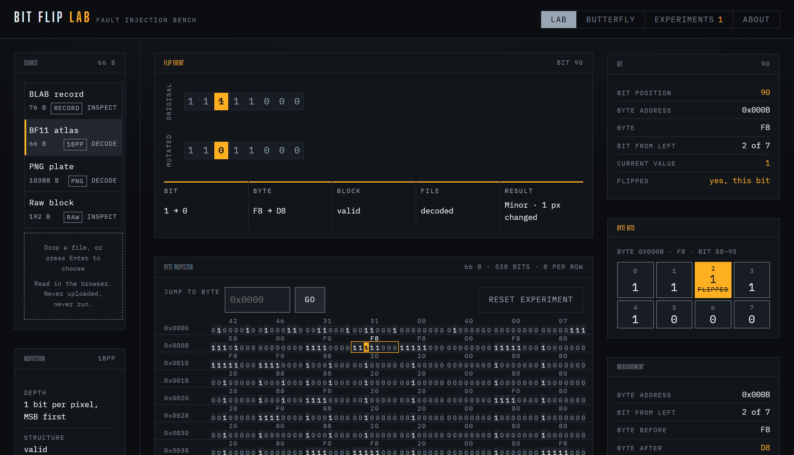
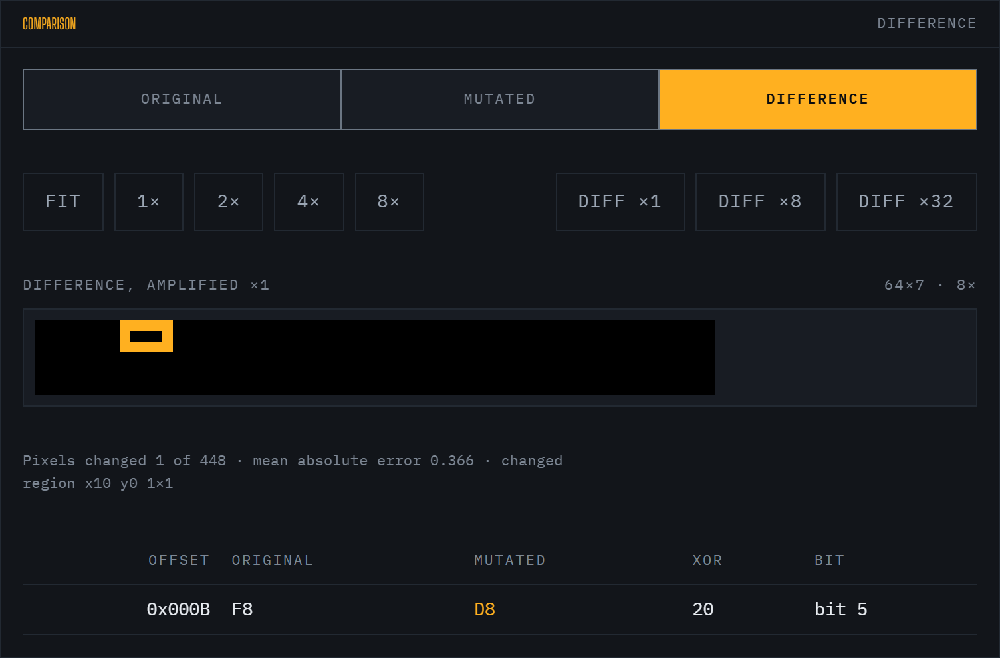
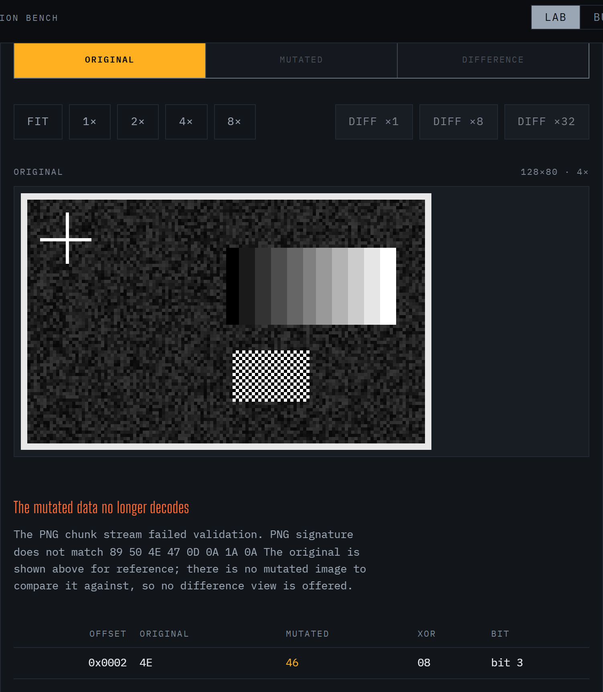
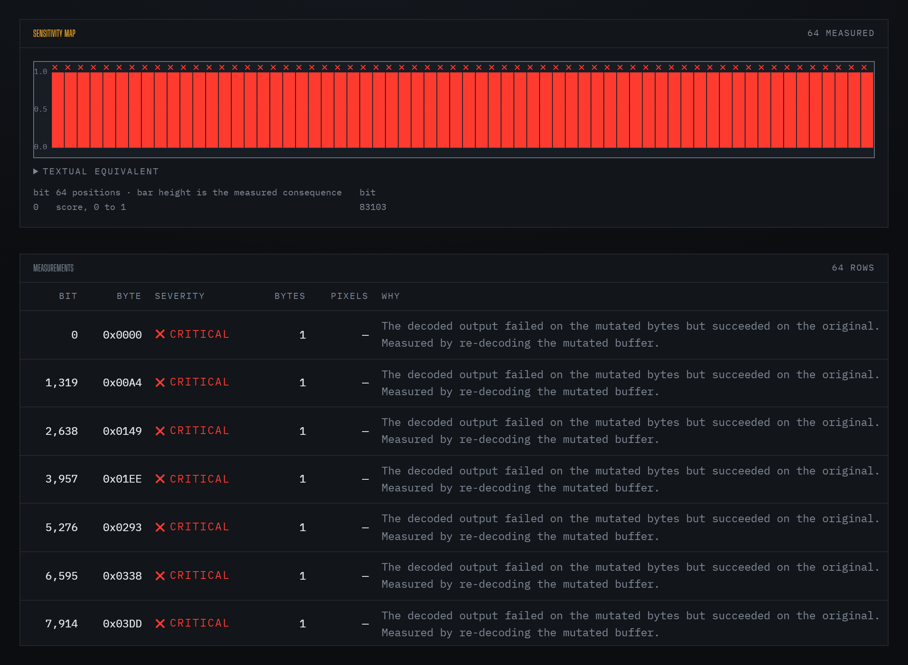

# Experiments

Complete methodology and measured results for the three shipped experiments.

Every number in this document was produced by the engine from the bytes. Nothing
here is estimated, extrapolated, or hand-written. See
[SCIENTIFIC_NOTES.md](SCIENTIFIC_NOTES.md) for what these results do and do not
demonstrate.



## Common ground

All three experiments run the same pipeline on the same engine:

```text
Input → Bit Selection → Mutation Engine → Format Adapter
      → Decoder / Inspector → Measurement → Severity
```

Two conventions apply throughout:

- **Bit numbering is MSB-first.** Bit 0 of a byte is its leftmost bit, matching
  the order hexadecimal is read in. The interface states this, because the
  opposite convention silently mislabels every bit.
- **Selecting a bit performs the mutation immediately.** There is no separate
  apply step. The measurement in view is always the result of a real, completed
  mutation.

Built-in sources:

| Source | Bytes | Policy | Decoder |
|---|---:|---|---|
| BLAB record | 76 | `INSPECT` | Structured record with its own CRC-32 |
| BF11 atlas | 66 | `DECODE` | 1-bit-per-pixel glyph atlas |
| PNG plate | 10388 | `DECODE` | PNG chunk stream, CRCs, IHDR |
| Raw block | 192 | `INSPECT` | None — stays `unclassified` |

---

## 01 — Glyph atlas: one bit, one pixel



The 1-bit glyph atlas stores one bit per pixel, so the mapping from mutation to
output is total — there is no encoding step between the byte and the image. Eight
glyphs, 64 × 7 = 448 pixels, MSB-first.

Selected bit: **90** — byte `0x000B`, the third bit from the left.

```text
BIT 90   byte 0x000B  F8 → D8   xor 0x20
Pixels changed:      1 of 448
Changed region:      x10 y0, 1×1
Mean absolute error: 0.366
Severity:            Minor — structure validated, 1 decoded field changed
```

**Observation.** The byte delta is one. The pixel delta is one. Both are stated
exactly rather than implied as something larger.

**Why Minor.** All structural checks pass — this is a well-formed BF11 atlas
either way — but at least one decoded field changed: `Pixel population: 101 →
100`.

### Reproducing

1. Open the Lab, choose **BF11 atlas**.
2. Jump to byte `0x000B`, select the third bit from the left (bit 90).
3. Read the measurement panel; open the **Difference** tab for the located region.

---

## 02 — PNG signature: one bit, and the file stops being a file



The same one-bit operation on a generated 128 × 80 greyscale PNG, moved a few
bits left into the 8-byte file signature.

Selected bit: **20** — byte `0x0002`, the fifth bit from the left.

```text
BIT 20   byte 0x0002  4E → 46   xor 0x08
Original:   renders normally
Mutated:    the browser's image decoder rejects the file
Reported:   PNG signature does not match 89 50 4E 47 0D 0A 1A 0A
Severity:   Critical — the decoded output failed on the mutated bytes
                        but succeeded on the original
```

**Observation.** The precise claim is that **the mutated buffer is no longer a
valid PNG and the decoder rejects it** — not that pixels were "destroyed". Nothing
was rendered from the mutated bytes, so there is no mutated image and no
difference view; the original is shown beside the failure for reference.

**Why Critical.** The rule is measured, not assumed: the tool re-decodes the
mutated buffer and observes that decoding succeeded on the original and failed on
the mutation.

This is the representation-boundary case. A bit that is unremarkable in pixel
payload is fatal in a signature. It does not generalise — most bits in this same
PNG are not Critical. The point is that *this* bit, *here*, is, and the tool says
so by measurement rather than by rule-of-thumb.

### Reproducing

1. Open the Lab, choose **PNG plate**.
2. Jump to byte `0x0002`, select the fifth bit from the left (bit 20).
3. The comparison panel reports the decoder failure and the located reason.

---

## 03 — Butterfly: sensitivity across positions



Butterfly Mode stops hand-picking bits. It chooses a bounded set of positions,
applies the identical single-bit mutation to each, and records the measured
consequence. The map is a direct plot of those measurements — no model, no
interpolation, no weighting.

```text
Source:     BLAB record, 76 bytes → 608 addressable bits
Sweep:      64 positions, evenly spaced, including first and last bit
Coverage:   10.5% of addressable bits
```

**Observation.** The four positions inside the 4-byte magic read **Critical** —
the record stops parsing. The remaining **60** read **Major** — it still parses
but its CRC-32 or its declared length no longer validates. Every row states the
located reason, verbatim:

```text
bit 0    0x0000  CRITICAL  The decoded output failed on the mutated bytes but
                       succeeded on the original. Measured by re-decoding the
                       mutated buffer.

bit 48   0x0006  MAJOR     2 structural checks failed while the buffer still
                       decodes. Measured: Length field at 0x06 declares
                       2147483724 bytes; file contains 76; CRC-32 at 0x48 is
                       0xCEC06CB0; computed 0x8EB545C3
```

**Same file. Different bit. Different consequence** — and the tool can say why,
with a field offset and both values.

### On coverage

Coverage is reported, not implied. 64 of 608 bits is **10.5%**, and the interface
says so on the measurement readout. Positions not in the sweep are drawn as
untested, never as "clean". Raising the sweep budget raises the coverage figure;
it never hides it.

---

## Severity classification

Severity is **derived by rule, never asserted**. Each level corresponds to one
rule, and the rule that fired is printed next to the result.

| Severity | Rule |
|---|---|
| **Critical** | The mutated bytes no longer decode. Measured by re-decoding the mutated buffer. |
| **Major** | It still decodes, but a structural integrity check fails — chunk CRC, declared length, record CRC-32. |
| **Minor** | All structural checks pass and at least one decoded field value changed. |
| **Negligible** | All checks pass, no decoded field changed, every rendered pixel identical. The bytes differ; nothing observable does. |
| **Unclassified** | No adapter claims the format, so nothing can be validated. Byte-level facts are still reported. |

The classification is one function, `core/classify.ts`, and it is unit tested. It
returns both the level and the human-readable rule that produced it, so the
interface never has to invent an explanation.

---

## Reproducing any experiment

Every experiment is stored as a record with a content-derived id, both SHA-256
digests, and the severity. **Experiments → Verify reproduction** re-runs the
recorded mutation and reports whether both digests and the severity match.

To verify by hand: load the matching sample, select the bit offset given in the
record, and compare the resulting SHA-256 before and after.

## Related

- [ARCHITECTURE.md](ARCHITECTURE.md) — the pipeline these experiments run on
- [SCIENTIFIC_NOTES.md](SCIENTIFIC_NOTES.md) — interpretation limits
- [QA.md](QA.md) — how these results are verified